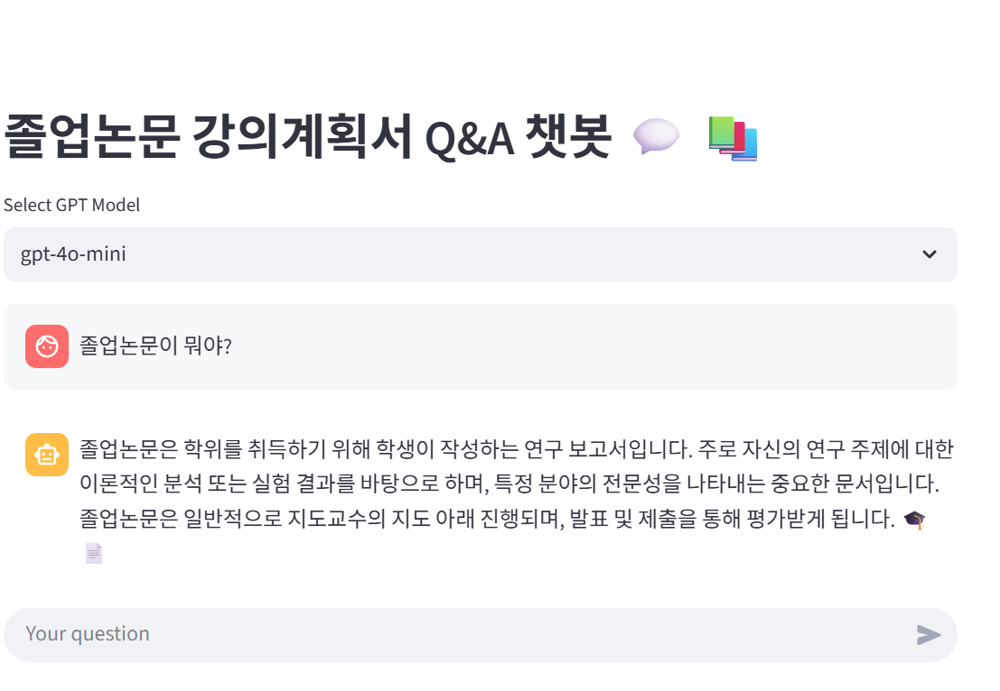
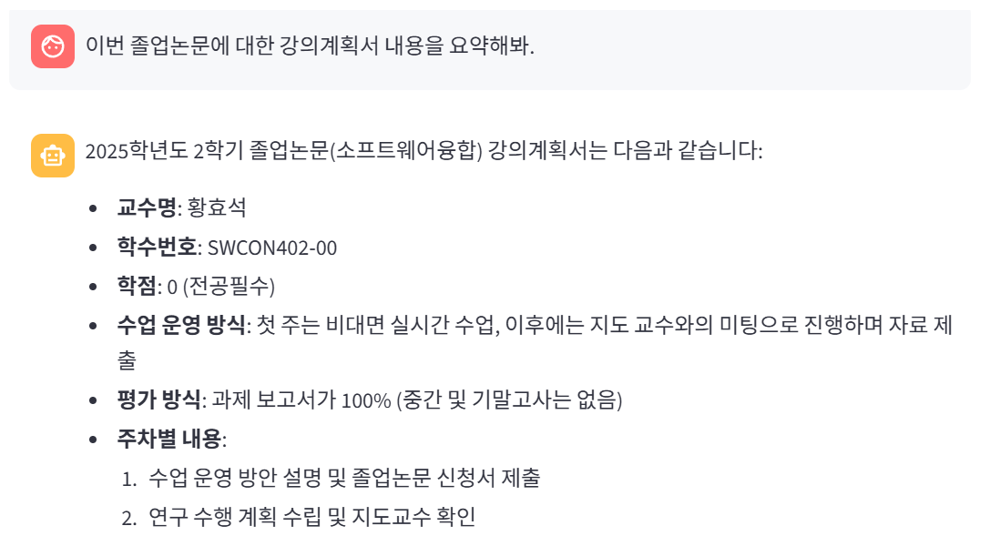
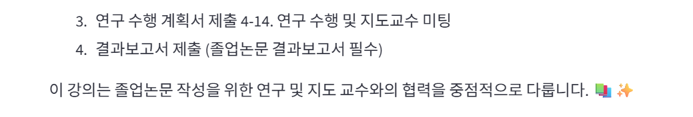
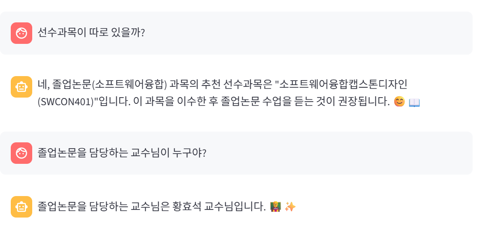
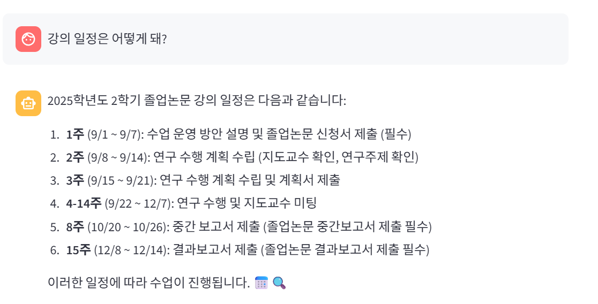

# :link: LangChain으로 자신이 듣고 싶은 과목에 대한 설명을 챗봇과 소통

## :traffic_light: 문제 정의

자신이 수강하고 싶은 강의 과목을 선정하고, 이에 해당하는 강의계획서를 읽었음에도, 내용이 많다 보니, 학생이 원하는 질의를 발췌하여 내용을 추출해내기가 힘들다.

## :warning: 문제의 결과

많은 대학생들은 강의 과목에 대해서 강의계획서를 읽는다 하더라도, 내용의 양이 많아서 까먹거나, 귀찮아서 강의 계획서를 대충 보다보면, 나중에 교수님의 강의를 듣다보면 불상사로 강의계획서에 있는 고려사항을 빼먹어 자신이 예상치도 못한 변수가 발생하게 되며, 이로 인해 원하는 학업 점수 부진, F학점 결과, 과제 미이수 및 부진 등 부정적인 결과가 초래할 수 있다.

## :arrow_down: 문제 해결 방향

:one: LangChain :link: 을 이용해서 자신이 듣고자하는 강의 과목에 대한 강의 계획서 PDF 파일을 객체로 삼아서 Langchain With OpenAI를 이용하여 챗봇을 생성.

:two: Github에 있는 계정을 이용하여 자신의 프로젝트 저장소를 새로 생성.

:three: Streamlit라는 프레임워크를 이용하여 웹으로 챗봇을 이용하여 배포를 합니다.

## :clock12: 문제 해결 방법

:one: 업로드된 강의 계획서 PDF에 업로드를 한다.

:two: 텍스트 Chunk들을 Chroma 안에 Embedding 벡터로 저장

:three: Chroma DB를 이용하여 DB 저장-검색기-History 모두 합친 Chain으로 시스템 구축

:four: 채팅 히스토리 요약 시스템, 질문-답변 시스템 프롬프트 이용하여 챗봇과 서로 채팅하며 설명. 예시를 들자면 다음과 같이 질문을 하였습니다.

## :mag_right: 결과 및 결론(인사이트 도출)

:one: 사람들은 요즘 시각적으로 보는 것에 대해서 자신이 원하는 것만 발췌하여 찾으려고 할 뿐, 전체적인 파일을 본다고 한 들, 일일이 눈으로 찾는데에 있어서 내용을 놓치는 경우가 있다고 생각하여 사용자가 원하는 질문에 대해서한 발췌를 하여 시간의 절약성을 도출할 수 있었다.

:two: PDF에 대해서 기존에 있는 생성형 AI API를 이용한다 하더라도, 사용량이 초과 되면 API에서 실행 차단이 되기 쉬우며, Open RAG(오픈소스 RAG)를 이용하여 부가 비용 없이 무료로 무한적으로 이용한다.